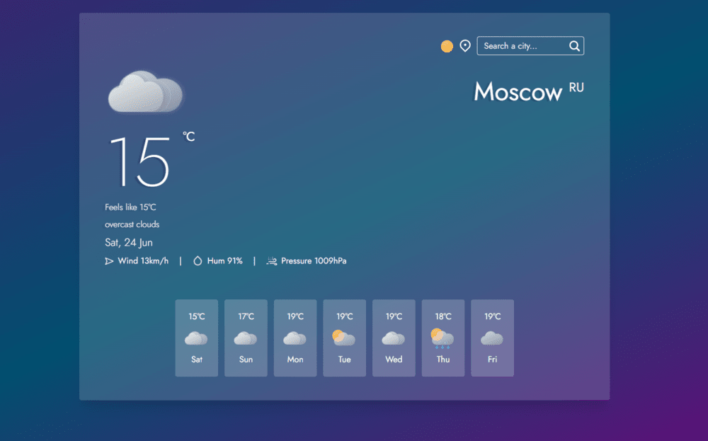
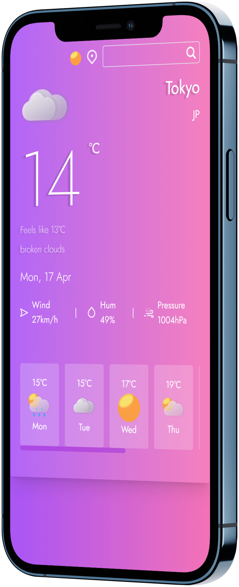

# Skyvibes

Skyvibes is a simple and user-friendly forecast website that provides you with the latest weather conditions and a three-day forecast for any location. With Skyvibes, you can easily plan your day, stay informed about the weather, and be prepared for any changes in weather conditions.

## Screenshot

## Features

- **Real-time weather conditions:** Skyvibes uses real-time data from reliable sources to provide you with accurate and up-to-date weather information.

- **Three-day forecast:** In addition to current weather conditions, Skyvibes also provides a three-day forecast so you can plan ahead and be prepared for any changes in weather.

- **User-friendly interface:** Skyvibes has a simple and intuitive interface that makes it easy to navigate and find the information you need.

- **Responsive design:** Whether you're using a desktop computer or a mobile device, Skyvibes is designed to work seamlessly on any screen size.

## Getting started

To get started with Skyvibes, simply visit the website at [www.skyvibes.vercel.app](https://skyvibes.vercel.app/) and enter your location in the search bar. Skyvibes will display the current weather conditions and a three-day forecast for your location.

## Note

Please note that this is not the final version of the project and changes are expected to be made in the future.
